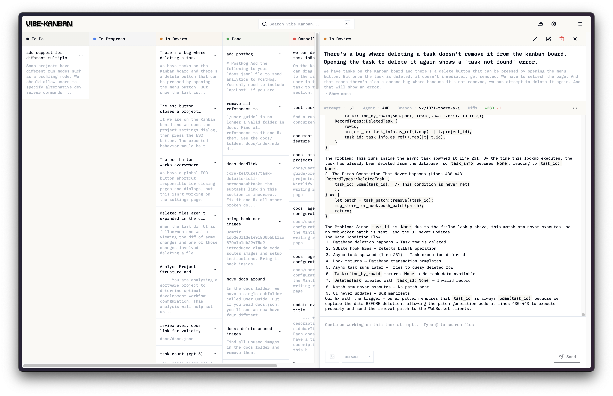

<p align="center">
  <a href="https://vibeboard.cloud">
    <picture>
      <source srcset="frontend/public/vibe-board-logo-dark.svg" media="(prefers-color-scheme: dark)">
      <source srcset="frontend/public/vibe-board-logo.svg" media="(prefers-color-scheme: light)">
      
    </picture>
  </a>
</p>

<p align="center">A fork of Vibe Kanban — an orchestration platform for AI coding agents with the legacy UI and enhanced features.</p>
<p align="center">
  <a href="https://www.npmjs.com/package/@wqyjh/vibe-board"></a>
  <a href="https://github.com/WqyJh/vibe-board/actions/workflows/pre-release.yml"></a>
</p>



## Overview

AI coding agents are increasingly writing the world's code and human engineers now spend the majority of their time planning, reviewing, and orchestrating tasks. Vibe Board streamlines this process, enabling you to:

- Easily switch between different coding agents
- Orchestrate the execution of multiple coding agents in parallel or in sequence
- Quickly review work and start dev servers
- Track the status of tasks that your coding agents are working on
- Centralise configuration of coding agent MCP configs
- Open projects remotely via SSH when running Vibe Board on a remote server

You can watch a video overview [here](https://youtu.be/TFT3KnZOOAk).

## About This Fork

This repository is a **fork of [vibe-kanban](https://github.com/BloopAI/vibe-kanban)**. The upstream project introduced a new UI that we found too complex for our workflow. We prefer the **legacy UI** for its simplicity and ease of use. This fork maintains a version of Vibe Board based on the **legacy UI**, so you can continue using the interface you're familiar with.

## New Features in This Fork

This fork adds the following features on top of the legacy UI:

### Agent Configuration

- **ACP-based agents support** — Added 11 new agent executors: auggie, cline, fast_agent, goose, junie, kilo, kimi, mistral_vibe, nova, qoder, stakpak. All agents support MCP configuration.
- **base_command_override for all agents** — All agents now support `base_command_override` to control the agent version, replacing executor-specific version fields. Usage: Set `base_command_override` in the agent configuration to specify a custom command or version.
- **Kilo Agent Model Parameter** — Added `model` configuration parameter to the Kilo agent. Usage: Set the `model` field in Kilo agent configuration to specify which model to use.
- **Cline Agent Model Parameter** — Added `model` parameter and updated version for Cline agent. Usage: Configure the `model` field in Cline agent settings.

### Git & Commit Features

- **Commit history panel** — View git commit history with diff viewing and revert support. Usage: Click the "Commit History" tab in the task panel to see all commits, view diffs, and revert changes if needed.
- **Generate merge commit message by agent** — Use an AI agent to draft merge commit messages for you. Usage: When merging, click "Generate with AI" to create a commit message based on the changes.
- **Custom commit message prompts** — Customise the AI prompt used to generate merge commit messages, with template variables `{current_branch}` and `{target_branch}`. Usage: Toggle "Use custom commit prompt" in Settings to edit the prompt, and enable "Generate commit message for single commit" to force AI generation for single-commit branches.
- **Commit after linter changed** — Automatically commit when the linter has made changes to your code. Usage: Enable in settings to auto-commit linter fixes.

### Terminal & Execution

- **Terminal panel with persistent sessions** — Open multiple terminal tabs with real PTY shells. Sessions persist across panel toggles and reconnect with full history. Usage: Click the "Terminal" tab in the task panel to open a terminal session.
- **Continue button** — Retry or continue failed/cancelled tasks directly from the action card. Usage: Click the "Continue" button on failed or cancelled tasks to retry execution.

### Remote Access & Notifications

- **E2EE gateway web UI** — End-to-end encrypted remote access with login, machine selection, and device pairing. Usage: Access the gateway URL, log in, select a machine, and enter your master secret to use the full interface.
- **Browser notifications** — Push notifications for task completion, approval, and cancellation in SSH tunnel and remote scenarios. Usage: Enable push notifications in Settings and grant browser permission when prompted.

### Task Management

- **Task configuration variant display** — Display configuration variant on task cards and panels. Usage: View the configuration variant directly on task cards to quickly identify task settings.
- **Copy worktree path button** — Copy worktree path button moved to shared task header for easier access. Usage: Click the copy button in the task header to copy the worktree path to clipboard.

## Installation

Make sure you have authenticated with your favourite coding agent. A full list of supported coding agents can be found in the [docs](https://vibeboard.cloud/docs). Then in your terminal run:

```bash
npx @wqyjh/vibe-board
```

## E2EE Remote Access

Vibe Board supports end-to-end encrypted remote access. You can securely access your board from any browser, even when your machine is behind a firewall. The gateway server only sees encrypted data — your content is never exposed.

```
Browser (holds keys)  ←──HTTPS──→  Gateway (zero-knowledge)  ←──WSS──→  Your Machine (vibe-board)
```

**How it works:**

1. **Deploy the Gateway** on a public server — it serves the Web UI and handles encrypted message routing
2. **Connect your machine** — the local `vibe-board` server connects to the gateway automatically
3. **Open the Gateway URL in a browser** — log in, enter your master secret, select your machine, and use the full vibe-board interface

All API calls and WebSocket streams are transparently encrypted in the browser before being sent through the gateway. See the [E2EE documentation](development/E2EE.md) for details.

## Documentation

Please head to the [website](https://vibeboard.cloud/docs) for the latest documentation and user guides.

## Support

For bugs and feature requests, please open an issue on this repo. For upstream issues, see [vibe-kanban](https://github.com/BloopAI/vibe-kanban).

## Contributing

Issues and pull requests are welcome! Feel free to open a PR directly or start a discussion if you want to propose a larger change.

## Development

### Prerequisites

- [Rust](https://rustup.rs/) (latest stable)
- [Node.js](https://nodejs.org/) (>=18)
- [pnpm](https://pnpm.io/) (>=8)

Additional development tools:
```bash
cargo install cargo-watch
cargo install sqlx-cli
```

Install dependencies:
```bash
pnpm i
```

### Running the dev server

```bash
pnpm run dev
```

This will start the backend. A blank DB will be copied from the `dev_assets_seed` folder.

### Building the frontend

To build just the frontend:

```bash
cd frontend
pnpm build
```

### Build from source (macOS)

1. Run `./local-build.sh`
2. Test with `cd npx-cli && node bin/cli.js`


### Environment Variables

The following environment variables can be configured at build time or runtime:

| Variable | Type | Default | Description |
|----------|------|---------|-------------|
| `POSTHOG_API_KEY` | Build-time | Empty | PostHog analytics API key (disables analytics if empty) |
| `POSTHOG_API_ENDPOINT` | Build-time | Empty | PostHog analytics endpoint (disables analytics if empty) |
| `PORT` | Runtime | Auto-assign | **Production**: Server port. **Dev**: Frontend port (backend uses PORT+1) |
| `BACKEND_PORT` | Runtime | `0` (auto-assign) | Backend server port (dev mode only, overrides PORT+1) |
| `FRONTEND_PORT` | Runtime | `3000` | Frontend dev server port (dev mode only, overrides PORT) |
| `HOST` | Runtime | `127.0.0.1` | Backend server host |
| `MCP_HOST` | Runtime | Value of `HOST` | MCP server connection host (use `127.0.0.1` when `HOST=0.0.0.0` on Windows) |
| `MCP_PORT` | Runtime | Value of `BACKEND_PORT` | MCP server connection port |
| `DISABLE_WORKTREE_CLEANUP` | Runtime | Not set | Disable all git worktree cleanup including orphan and expired workspace cleanup (for debugging) |
| `VB_ALLOWED_ORIGINS` | Runtime | Not set | Comma-separated list of origins that are allowed to make backend API requests (e.g., `https://my-vibekanban-frontend.com`) |

**Build-time variables** must be set when running `pnpm run build`. **Runtime variables** are read when the application starts.

#### Self-Hosting with a Reverse Proxy or Custom Domain

When running Vibe Board behind a reverse proxy (e.g., nginx, Caddy, Traefik) or on a custom domain, you must set the `VB_ALLOWED_ORIGINS` environment variable. Without this, the browser's Origin header won't match the backend's expected host, and API requests will be rejected with a 403 Forbidden error.

Set it to the full origin URL(s) where your frontend is accessible:

```bash
# Single origin
VB_ALLOWED_ORIGINS=https://vk.example.com

# Multiple origins (comma-separated)
VB_ALLOWED_ORIGINS=https://vk.example.com,https://vk-staging.example.com
```

### Remote Deployment

When running Vibe Board on a remote server (e.g., via systemctl, Docker, or cloud hosting), you can configure your editor to open projects via SSH:

1. **Access via tunnel**: Use Cloudflare Tunnel, ngrok, or similar to expose the web UI
2. **Configure remote SSH** in Settings → Editor Integration:
   - Set **Remote SSH Host** to your server hostname or IP
   - Set **Remote SSH User** to your SSH username (optional)
3. **Prerequisites**:
   - SSH access from your local machine to the remote server
   - SSH keys configured (passwordless authentication)
   - VSCode Remote-SSH extension

When configured, the "Open in VSCode" buttons will generate URLs like `vscode://vscode-remote/ssh-remote+user@host/path` that open your local editor and connect to the remote server.

See the [documentation](https://vibeboard.cloud/docs/configuration-customisation/global-settings#remote-ssh-configuration) for detailed setup instructions.
